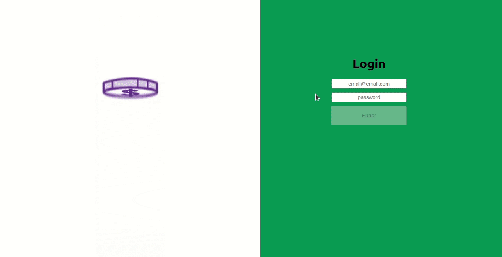

# Seja bem vindo ao Project-Wallet!

## Descrição do Projeto
> FRONT-END
<p>:rocket: O objetivo do projeto foi construir uma carteira na qual pode armazenar e excluir as despesas de acordo com a moeda escolhida e 
também implementar uma página de login super legal! :smile:</p>

### Tecnologias Utizadas :nerd_face:

- [x] React.JS / Componentes de classe
- [x] Redux
- [x] React-router

### GIF da aplicação :point_down:



## Instruções 

> Rode o comando em seu terminal 

```
git clone git@github.com:JoaoVFerreira/Project-Wallet.git
```

> Entre na pasta do projeto 

```
cd Project-Wallet
```

> Instale as dependências

```
npm install
```

> Rode o comando npm start

```
npm start
```

### Obrigado e DIVIRTA-SE :tada:
